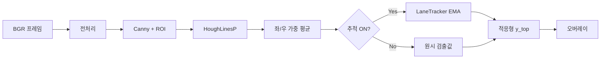

# Lane Tracking

전통적 컴퓨터 비전 기반의 **차선 검출·추적** 데모입니다. 딥러닝 없이 OpenCV만 사용하며, Canny 엣지 → Hough 직선 → 좌/우 차선 분리 → 시간적 스무딩 → 오버레이 시각화 파이프라인으로 구성됩니다.

## 개요

| 항목 | 내용 |
|------|------|
| 언어 | Python 3.12+ |
| 의존성 | `opencv-python`, `numpy` |
| 진입점 | `main.py` |
| 추적 방식 | 프레임별 classical detection + **EMA(지수이동평균)** |

이 프로젝트의 “tracking”은 딥러닝·칼만 필터·광학 흐름이 아니라, **매 프레임 검출 + 직선 파라미터 `(기울기 m, 절편 b)` 의 시간축 스무딩 + 기하 검증** 조합입니다.

## 디렉터리 구조

```
lane_tracking/
├── main.py              # CLI (카메라 / 이미지 / 비디오)
├── requirements.txt
├── src/
│   ├── pipeline.py      # 전체 파이프라인 조립
│   ├── preprocess.py    # 그레이스케일 + 가우시안 블러
│   ├── edge_detector.py # Canny + ROI 마스크
│   ├── lane_detector.py # HoughLinesP + 좌/우 직선 추정
│   ├── lane_geometry.py # 검증, 적응형 지평선
│   ├── lane_tracker.py  # 프레임 간 EMA 스무딩
│   └── visualize.py     # 폴리곤 / 직선 오버레이
├── scripts/
│   ├── generate_test_frame.py  # 합성 도로 이미지 생성
│   └── verify_pipeline.py      # 헤드리스 스모크 테스트
└── assets/              # 테스트·디버그 이미지
```

## 사용 방법

### 설치

```bash
python -m venv .venv
source .venv/bin/activate
pip install -r requirements.txt
```

### 실행 예시

```bash
# 웹캠
python main.py 0

# 비디오 → 저장 (헤드리스)
python main.py 1_2.mp4 -o 1_2_lane_tracked.mp4 --no-display

# 엣지 맵 함께 보기
python main.py video.mp4 --show-edges

# 추적 비활성화 (프레임별 독립 검출)
python main.py video.mp4 --no-track

# Canny 임계값 조정
python main.py video.mp4 --canny-low 40 --canny-high 120

# 단일 이미지 저장
python main.py image.jpg --save result.jpg --no-display
```

### CLI 옵션

| 옵션 | 설명 |
|------|------|
| `input` | 비디오 경로, 이미지 경로, 또는 카메라 인덱스 (기본: `0`) |
| `-o`, `--output` | 주석이 그려진 비디오 저장 경로 |
| `--show-edges` | 결과 옆에 엣지 맵 표시 |
| `--no-track` | 시간적 스무딩 비활성화 |
| `--canny-low`, `--canny-high` | Canny 임계값 |
| `--save` | 이미지 입력 시 결과 저장 |
| `--no-display` | GUI 없이 실행 (`--output` 또는 `--save` 필요) |

## 처리 파이프라인

프레임당 `LanePipeline.process_frame()` 기준 처리 흐름입니다.

```
BGR 프레임
  → [1] 그레이스케일 + 가우시안 블러
  → [2] Canny 엣지
  → [3] 사다리꼴 ROI 마스크
  → [4] HoughLinesP 직선 세그먼트
  → [5] 근거리 가중 평균 → 좌/우 (m, b)
  → [6] validate_near_detection
  → [7] LaneTracker.update (EMA) — use_tracking=True 일 때
  → [8] 적응형 y_top + horizon EMA
  → [9] 폴리곤·직선 오버레이
```



## 단계별 상세

### 1. 전처리 (`preprocess.py`)

- BGR → 그레이스케일 → 5×5 가우시안 블러
- 노이즈를 줄인 뒤 엣지 검출에 사용

### 2. 엣지 검출 (`edge_detector.py`)

- `cv2.Canny` (기본 low=50, high=150)
- **사다리꼴 ROI**: 화면 하단 중앙만 남겨 하늘·건물 엣지 제거
- ROI 상단은 추적기의 `y_top_ratio`와 연동 (`draw_y_top - 0.04`, 최소 `roi_top_min_ratio=0.58`)

### 3. 차선 검출 (`lane_detector.py`)

1. `cv2.HoughLinesP`로 짧은 선분 추출
2. 세그먼트 중심 y가 화면 **48% 이상**(아래쪽)인 것만 사용
3. 기울기 부호: **음수 = 좌차선**, **양수 = 우차선**
4. 가중치 `w = (y_center / height)²` → 화면 아래(가까운 차선)에 더 큰 비중
5. 좌/우 각각 가중 평균 → `(m, b)` 한 쌍
6. `validate_near_detection` 통과 실패 시 빈 `LaneLines()` 반환

**근거리 검증 조건** (`lane_geometry.validate_near_detection`):

- 좌: `m < 0`, 우: `m > 0`, 기울기 0.35 ~ 4.0
- 화면 맨 아래에서 좌·우 x 간격 ≥ 60px
- 좌·우가 화면 중앙 ±15% 안에 위치
- 두 직선 교차점이 근거리 구간(78% 이하) 안에 있으면 거부 (X자 차선 방지)

### 4. 시간적 추적 (`lane_tracker.py`)

검출값을 받아 스무딩된 차선을 반환합니다. Kalman·딥러닝·객체 ID 추적은 사용하지 않습니다.

| 메커니즘 | 역할 |
|----------|------|
| **EMA** (α≈0.93) | 기울기·절편 떨림 감소 |
| **hold-last** | 검출 실패 시 이전 프레임 값 유지 |
| **consistency gate** | 기울기/절편 급변 시 α를 0.98로 올려 오검출 억제 |
| **adaptive y_top** | 폴리곤 상단 높이 자동 조절 |
| **horizon EMA** (α≈0.88) | 지평선 프레임 간 부드럽게 변화 |
| **ROI feedback** | 이전 지평선 → 다음 프레임 엣지 ROI |

**EMA 수식** (일관된 측정일 때):

```
m_t = 0.93 * m_{t-1} + 0.07 * m_det
b_t = 0.93 * b_{t-1} + 0.07 * b_det
```

측정이 없으면 `m_t = m_{t-1}`, `b_t = b_{t-1}`.

**추적 상태** (프레임 간 유지):

```
프레임 t-1: (_left, _right, _y_top_ratio)
프레임 t:   Hough 검출 → EMA → 상태 갱신 또는 hold
            _y_top_ratio → ROI 상단 + 폴리곤 상단
```

### 5. 적응형 지평선 (`lane_geometry.py`)

`find_adaptive_y_top_ratio`: `y_top_ratio`를 0.74에서 0.02씩 줄이며 `validate_lane_pair`를 반복합니다. 교차·겹침 직전까지 올릴 수 있는 가장 먼 지평선을 선택해 초록 폴리곤 상단을 결정합니다.

### 6. 시각화 (`visualize.py`)

- 좌차선: 파란색, 우차선: 빨간색 (굵기 8)
- 차선 사이: 초록색 반투명 폴리곤 (α=0.4)
- `--show-edges`: 엣지 맵을 결과 옆에 가로로 이어 붙임

## 검출 vs 추적

| 구분 | 담당 모듈 | 설명 |
|------|-----------|------|
| **Detection** | `edge_detector`, `lane_detector` | 매 프레임 독립: 엣지 → Hough → 근거리 검증 |
| **Tracking** | `lane_tracker` | detection 결과의 시간적 안정화 + 지평선·ROI 연동 |

`--no-track` 또는 `use_tracking=False`이면 7단계(추적)를 건너뛰고 검출값만 사용합니다.

## 사용하지 않은 방식

| 이 프로젝트 | 미사용 |
|-------------|--------|
| Canny + HoughLinesP | CNN / 세그멘테이션 |
| 이미지 좌표 직선 `y = mx + b` | Bird's-eye 다항식, 스플라인 |
| EMA | Kalman filter, particle filter |
| hold-last | ID 기반 multi-object tracking |

## 설정값 (`LanePipelineConfig`)

| 파라미터 | 기본값 | 의미 |
|----------|--------|------|
| `canny_low` / `canny_high` | 50 / 150 | Canny 임계값 |
| `blur_kernel` | 5 | 가우시안 블러 커널 |
| `hough_threshold` | 20 | Hough 투표 임계 |
| `min_line_length` | 50 | Hough 최소 선분 길이 |
| `max_line_gap` | 15 | Hough 최대 간격 |
| `smoothing` | 0.93 | 차선 (m, b) EMA 계수 |
| `horizon_smoothing` | 0.88 | 지평선 EMA 계수 |
| `use_tracking` | True | 추적 활성화 |
| `roi_top_min_ratio` | 0.58 | ROI 상단 한계 |
| `y_top_min_ratio` | 0.52 | 폴리곤 상단 최소 (가장 위) |
| `y_top_max_ratio` | 0.74 | 폴리곤 상단 최대 (보수적) |
| `y_near_ratio` | 0.78 | 근거리 검증 기준선 |
| `y_detect_min_ratio` | 0.48 | Hough 세그먼트 최소 y |
| `min_separation_px` | 60 | 좌우 차선 최소 간격 (px) |

`LaneTracker` 추가 파라미터:

| 파라미터 | 기본값 | 의미 |
|----------|--------|------|
| `max_slope_delta` | 0.35 | 프레임 간 허용 기울기 변화 |
| `max_intercept_delta` | 80.0 | 프레임 간 허용 절편 변화 (px) |

## 테스트

```bash
# 합성 도로 이미지 생성
python scripts/generate_test_frame.py

# 파이프라인 스모크 테스트 (assets/test_road.png 필요)
python scripts/verify_pipeline.py
```

`verify_pipeline.py`는 `assets/test_result.png`를 생성하고 좌·우 차선이 모두 검출되는지 assert합니다.

## 설계 특징

**장점**

- 모듈 분리가 명확함 (검출 / 기하 / 추적 / 시각화)
- `LanePipelineConfig`로 하이퍼파라미터 일원화
- 근거리 가중·ROI·적응형 지평선으로 원근 왜곡을 일부 반영
- EMA + hold-last로 프레임 간 깜빡임 완화

**한계**

- 차선을 직선 1개로 모델링 → 곡선·급커브 도로에서 한계
- 조명 변화, 희미한 마킹, 가림에 취약
- EMA 지연으로 급격한 차선 변경·차선 변경 구간에서 늦게 반응
- 검출 실패 시 hold-last로 잘못된 위치가 고정될 수 있음

## 라이선스

프로젝트 루트에 별도 라이선스 파일이 없습니다. 사용 시 저장소 소유자에게 확인하세요.
